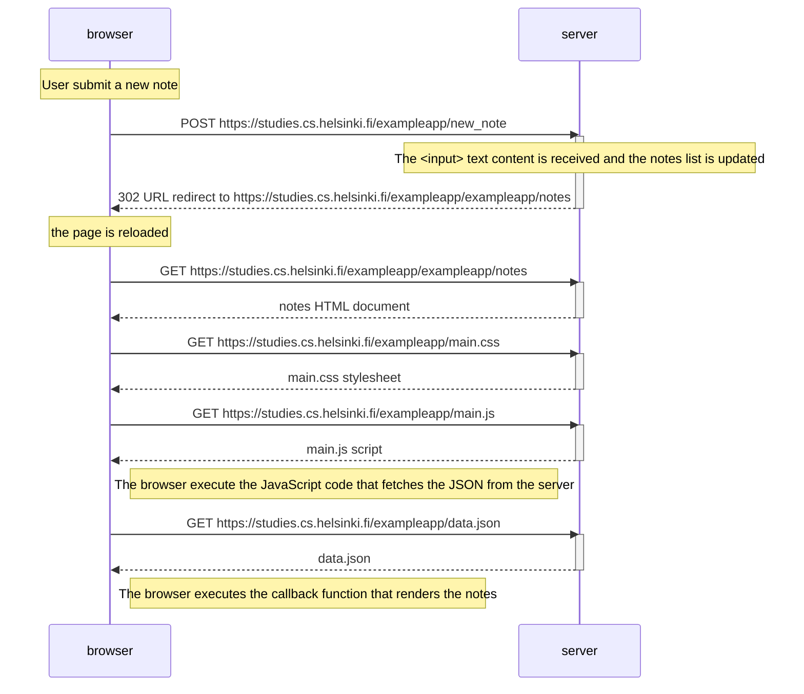

```mermaid

sequenceDiagram
    participant browser
    participant server

    Note over browser: User submit a new note
    browser->>server: POST https://studies.cs.helsinki.fi/exampleapp/new_note
    activate server
    Note over server: The <input> text content is received and the notes list is updated
    server-->>browser: 302 URL redirect to https://studies.cs.helsinki.fi/exampleapp/exampleapp/notes
    deactivate server

    Note over browser: the page is reloaded
    browser->>server: GET https://studies.cs.helsinki.fi/exampleapp/exampleapp/notes
    activate server
    server-->>browser: notes HTML document
    deactivate server

    browser->>server: GET https://studies.cs.helsinki.fi/exampleapp/main.css
    activate server
    server-->>browser: main.css stylesheet
    deactivate server

    browser->>server: GET https://studies.cs.helsinki.fi/exampleapp/main.js
    activate server
    server-->>browser: main.js script
    deactivate server

    Note right of browser: The browser execute the JavaScript code that fetches the JSON from the server

    browser->>server: GET https://studies.cs.helsinki.fi/exampleapp/data.json
    activate server
    server-->>browser: data.json
    deactivate server

    Note right of browser: The browser executes the callback function that renders the notes

```