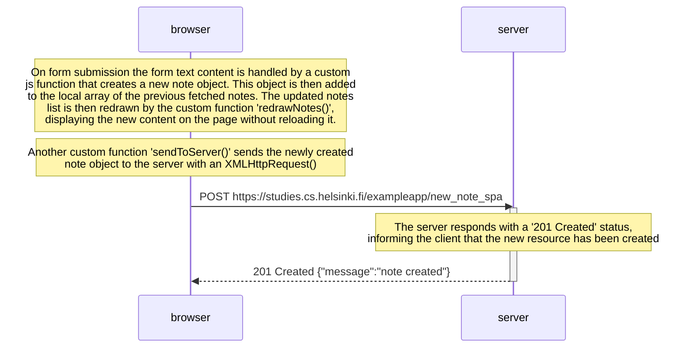

```mermaid

sequenceDiagram
    participant browser
    participant server

    Note over browser: On form submission the form text content is handled by a custom <br/> js function that creates a new note object. This object is then added <br/>to the local array of the previous fetched notes. The updated notes <br/>list is then redrawn by the custom function 'redrawNotes()',<br/> displaying the new content on the page without reloading it.
    Note over browser: Another custom function 'sendToServer()' sends the newly created <br/> note object to the server with an XMLHttpRequest()
    browser->>server: POST https://studies.cs.helsinki.fi/exampleapp/new_note_spa
    activate server
    Note over server: The server responds with a '201 Created' status, <br/>informing the client that the new resource has been created
    server-->>browser: 201 Created {"message":"note created"}
    deactivate server

```