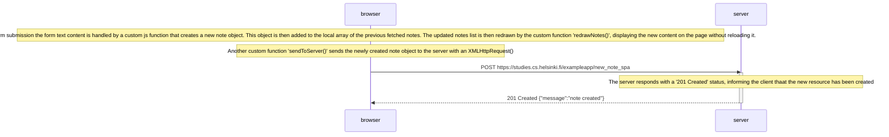

```mermaid

sequenceDiagram
    participant browser
    participant server

    Note over browser: On form submission the form text content is handled by a custom js function that creates a new note object. This object is then added to the local array of the previous fetched notes. The updated notes list is then redrawn by the custom function 'redrawNotes()', displaying the new content on the page without reloading it.
    Note over browser: Another custom function 'sendToServer()' sends the newly created note object to the server with an XMLHttpRequest()
    browser->>server: POST https://studies.cs.helsinki.fi/exampleapp/new_note_spa
    activate server
    Note over server: The server responds with a '201 Created' status, informing the client thaat the new resource has been created
    server-->>browser: 201 Created {"message":"note created"}
    deactivate server

```